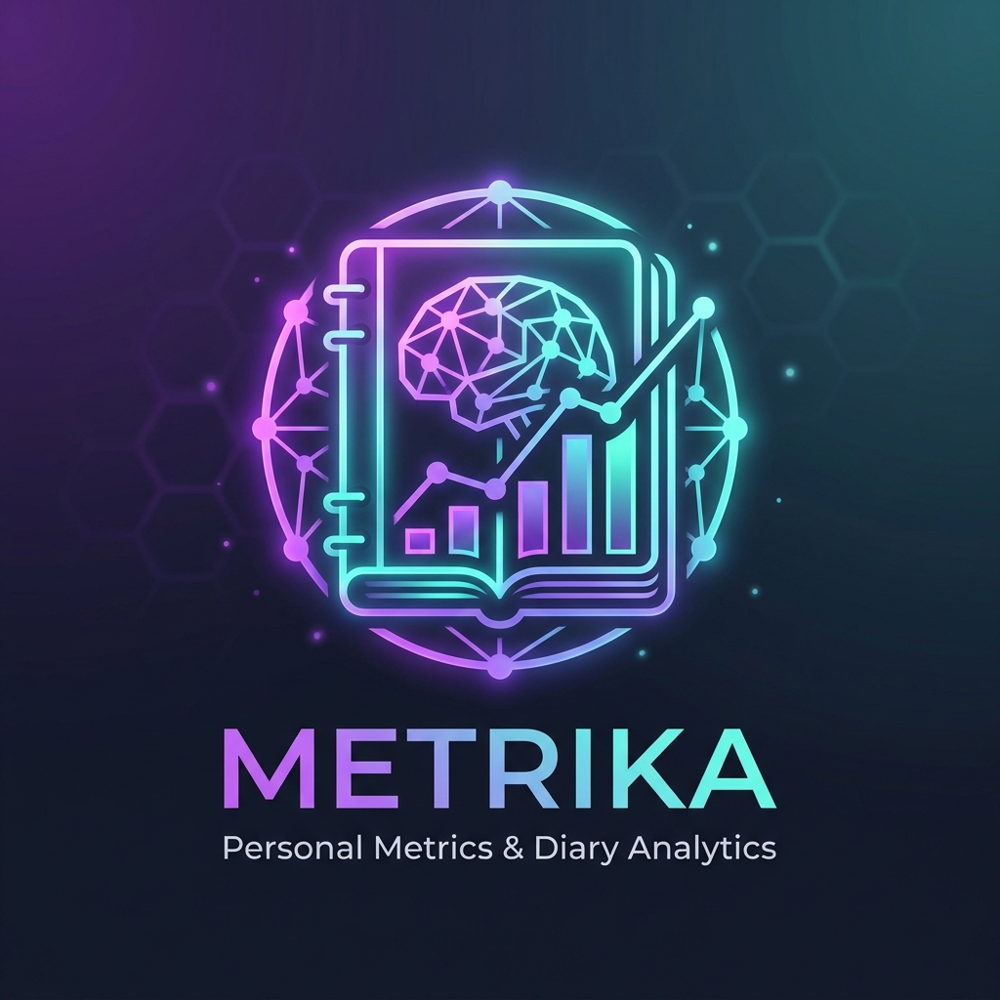
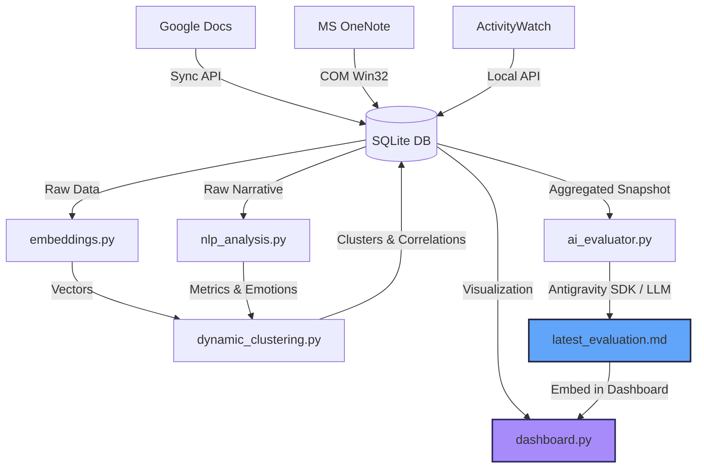

# 📓 Personal Metric: Cognitive Mirror & Diary Analytics

<p align="center">
  
</p>

> **Personal Metric** is an advanced, automated pipeline that acts as a cognitive mirror. It transforms raw, qualitative diary narratives (from Google Docs or Microsoft OneNote) and quantitative screen-time metrics (from ActivityWatch) into deep psychological, behavioral, and linguistic insights. 

Using vector semantics, natural language processing (NLP), density-based clustering, and automated AI evaluation, this project tracks your mental state, writing style, emotional diversity, and digital habits over time. It presents these insights in a stunning, glassmorphic, interactive Streamlit dashboard.

---

## 🚀 Key Features

### 1. Multi-Source Ingestion & Sync
*   **Google Docs Integration:** Securely syncs diary entries from a specified Google Doc, extracting textual content along with inline custom metrics (Mood, Energy, Focus, Location).
*   **Microsoft OneNote Integration:** *(Currently Non-Functional)* Legacy automation of local Windows COM interfaces (`pywin32`) to extract entries directly from your `Personal notes -> dailynotes` section.
    > [!WARNING]
    > **OneNote Ingestion Status: Broken / Disabled.** Live automated syncing from local OneNote COM is currently non-functional. The pipeline's active syncing is fully routed to Google Docs. Historical OneNote data can still be imported using exported text dumps.
*   **ActivityWatch (AW) Sync:** Queries your local ActivityWatch server to fetch total active screen-time and top application usage, correlating them with daily diaries.

### 2. Multi-Dimensional NLP Pipeline
*   **Lexical & Style Analysis:** Measures word counts, vocabulary richness via Type-Token Ratio (TTR), average sentence length, and structural variability.
*   **Grammatical Ratios:** Calculates POS (Part-of-Speech) ratios (Nouns, Verbs, Adjectives, Adverbs) and first-person pronoun density (which correlates with self-focus vs. external focus).
*   **Linguistic Creativity Score:** A composite metric evaluating vocabulary diversity, Hapax Legomena ratio (words appearing exactly once), and sentence length variance.
*   **Emotion & Sentiment Profiling:** 
    *   **VADER Sentiment:** Fast polarity (-1 to +1) and subjectivity (0 to 1) indexing.
    *   **DistilRoBERTa Emotion Classifier:** Sophisticated multi-label classifier scoring discrete emotions (Joy, Sadness, Anger, Fear, Surprise).
    *   **Emotion Diversity:** Computes the variance/spread of emotional vocabularies to track emotional complexity.

### 3. Dynamic Vector Clustering & Dimensionality Reduction
*   **Sentence Embeddings:** Embeds text combined with metadata using `all-MiniLM-L6-v2`.
*   **Dimensionality Reduction:** Maps high-dimensional embeddings to 2D space using **UMAP** for visualization.
*   **Dual-Algorithm Clustering:** 
    *   **HDBSCAN:** Density-based clustering to discover organic, irregular cluster shapes (capturing overarching life themes).
    *   **K-Means:** Generates centroid-based clusters, dynamically optimizing the cluster count $K$ based on silhouette scores.
*   **Statistical Correlation Engine:** Automatically calculates **Pearson correlation coefficients** ($r$) and $p$-values between cluster membership and NLP/device metrics (e.g., *Is screen-time positively correlated with write-ups containing higher anxiety?*).

### 4. Interactive Glassmorphic Dashboard
*   **Overview Panel:** Sleek glassmorphic KPI cards with week-over-week trends.
*   **Linguistic & Style Trends:** Track writing patterns, grammatical drift, and vocabulary richness over time.
*   **Emotion Heatmaps & Time-Series:** Visual representation of emotional evolution.
*   **Interactive 2D Cluster Map:** Plotly-based scatter plot showing semantic clusters of diary entries.
*   **Correlation Heatmap:** Statistical overview of the relationship between your digital behaviors (apps, screen time) and emotional themes.
*   **AI Evaluation Panel:** Run or display a structured, automated report evaluating your pipeline's validity and offering custom self-development advice.

---

## 🛠️ System Architecture



---

## 📦 Installation & Setup

### 1. Prerequisites
*   **Python:** 3.10 to 3.12 (recommended).
*   **ActivityWatch:** Ensure [ActivityWatch](https://activitywatch.net/) is installed and running locally.
*   **Microsoft OneNote (Optional):** If using OneNote extraction, ensure OneNote desktop is open and running in the same user session.

### 2. Clone and Install Dependencies
```bash
# Clone the repository
git clone <your-repo-url>
cd personal-metric

# Create and activate virtual environment
python -m venv venv
venv\Scripts\activate

# Install required packages
pip install -r requirements.txt

# Download spaCy model
python -m spacy download en_core_web_sm
```

### 3. Google API Setup (For Google Docs)
If you want to sync from Google Docs:
1.  Go to the [Google Cloud Console](https://console.cloud.google.com/).
2.  Create a project, enable the **Google Docs API**, and generate a **Service Account** credential JSON file.
3.  Rename the downloaded credentials file to `google_credentials.json` and place it in the root of the project directory.
4.  Share your Google Doc with the service account email address (found inside `google_credentials.json`) with Read permission.
5.  Open `config.py` and update the `GDOCS_DOCUMENT_ID` with your document's ID (found in the Doc's URL).

---

## 🏃 How to Run

### 1. Run Data Ingestion & Analysis Pipeline
This script initializes the database, pulls raw metrics, processes text embeddings, computes NLP metrics, clusters the diary entries, and runs the AI evaluation.
```bash
python main.py
```

### 2. Launch the Streamlit Dashboard
```bash
streamlit run dashboard.py
```
*The dashboard will automatically open in your default browser at `http://localhost:8501`.*

---

## 🧠 What Can We Understand?

*   **Self-Focus and Mood:** Does a high ratio of first-person pronouns (`I`, `me`, `my`) correlate with higher sadness or anger scores?
*   **The Screen-Time Penalty:** Does active PC time (ActivityWatch) correlate with lower vocabulary diversity or lower mood score?
*   **Linguistic Creativity Indicators:** Are your most creative diary entries written on weekends, or are they associated with specific emotional states like joy or surprise?
*   **Core Psychological Clusters:** What are the organic clusters in your diary? For example, one cluster might represent "High-energy work planning" (high focus, high nouns), while another represents "Reflective relaxation" (high adjectives, high sentiment).

---

## 🔮 Futuristic Features (Roadmap)

- [ ] **Longitudinal Cognitive Forecasting:** Use seasonal decomposition and LSTM neural networks to forecast future dip points in mood/focus based on current digital habits.
- [ ] **Cognitive Distortions Scanner:** An automated NLP parser checking diary entries for cognitive distortions (e.g., catastrophizing, emotional reasoning, black-and-white thinking) and offering CBT-based reframing.
- [ ] **Activity-to-Flow State Mapping:** Deeply correlate specific IDEs/code editors usage with high-focus diaries to isolate physical variables that trigger creative flow.
- [ ] **Offline LLM Integration:** Integrate local Ollama / Llama 3 models to provide full, local, offline psychoanalytic insights without transmitting personal thoughts to the cloud.
- [ ] **Physiological Data Overlay:** Synchronize wearable device data (Garmin/Fitbit/Apple Health) to overlay sleep quality, HRV (Heart Rate Variability), and daily physical strain onto cognitive metrics.

---

## ⚠️ Known Incompatibilities & Troubleshooting

*   **Microsoft OneNote Ingestion:** Live COM automation via `pywin32` is currently disabled and non-functional. If you have historical OneNote diary data, export it to a plain text file, normalize it, and import it using the `migrate_from_txt.py` script. The active live pipeline is configured to use Google Docs.
*   **Google Antigravity SDK & Protobuf Versioning:** When running on newer Python runtimes (e.g., Python 3.14), you may encounter a Protobuf edition validation error (e.g., `Edition UNKNOWN is later than the maximum edition 2023`). If this occurs, the script automatically catches the exception and falls back to a rule-based heuristic evaluation report without crashing.
*   **ActivityWatch Connection:** The pipeline attempts to connect to ActivityWatch running locally at `http://localhost:5600`. If ActivityWatch is not installed or running, the pipeline will log a warning and proceed without screen-time metrics, leaving those columns null.

---

## 🔒 Security & Privacy

This application is built with **privacy-first principles**. 
*   **Local Processing:** All embeddings, NLP metrics, and SQLite databases are stored **locally** on your machine (`personal_metric.db`).
*   **Zero Cloud Leakage (Fallback):** The standard analysis uses offline HuggingFace models, nltk, and spaCy.
*   **Git Security:** The repository includes a robust `.gitignore` ensuring that your SQLite databases, raw text files, json dumps, and Google credentials are never committed or pushed to remote repositories.

---

*Made with 💜 by Antigravity.*
